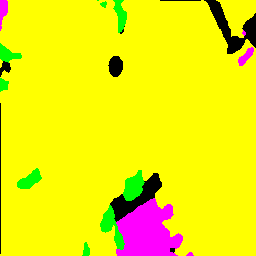

# Semantic Segmentation Using Deep Learning

## Project Overview

This project performs semantic segmentation on aerial drone imagery using deep learning techniques. The objective is to classify every pixel in a drone image into meaningful land-cover categories, enabling detailed scene understanding and automated analysis of aerial environments.

Unlike traditional image classification, which assigns a single label to an entire image, semantic segmentation performs pixel-level classification, providing a detailed segmentation map of the scene.

---

## Problem Statement

Manual analysis of aerial drone images is time-consuming and prone to human error. Accurate identification of different land-cover regions is important for applications such as urban planning, environmental monitoring, agriculture, and autonomous navigation.

This project aims to automate land-cover identification by using state-of-the-art semantic segmentation models to classify each pixel in drone imagery.

---

## Dataset

**Dataset:** Semantic Drone Dataset

The Semantic Drone Dataset consists of high-resolution aerial images captured using drones along with corresponding segmentation masks. Each pixel in the image is assigned a semantic class representing a specific land-cover category or object.

Dataset Link:

https://www.kaggle.com/datasets/bulentsiyah/semantic-drone-dataset

---

## Objectives

* Perform pixel-level classification of aerial drone images.
* Implement multiple semantic segmentation architectures.
* Compare model performance using standard evaluation metrics.
* Identify the most effective architecture for semantic segmentation of drone imagery.

---

## Models Implemented

### 1. PSPNet + ResNet34

PSPNet utilizes Pyramid Scene Parsing to capture both local and global contextual information for segmentation.

### 2. DeepLabV3+ + ResNet34

DeepLabV3+ employs Atrous Spatial Pyramid Pooling (ASPP) and an encoder-decoder architecture for accurate semantic segmentation.

### 3. DeepLabV3+ + ConvNeXt-Tiny

This model combines the DeepLabV3+ segmentation architecture with the modern ConvNeXt-Tiny backbone, enabling improved feature extraction and segmentation performance.

---

## Methodology

### Data Preprocessing

* Image resizing
* Mask preprocessing
* Class mapping
* Data loading using PyTorch DataLoader

### Training Pipeline

1. Load drone images and segmentation masks.
2. Extract features using backbone networks.
3. Perform pixel-wise classification using segmentation architectures.
4. Compute Cross Entropy Loss.
5. Update model weights through backpropagation.
6. Evaluate performance using segmentation metrics.

### Evaluation Metrics

The following metrics were used:

* Pixel Accuracy
* Mean Intersection over Union (mIoU)
* Dice Score

---

## Sample Prediction



## Results

| Model                      | Pixel Accuracy | Mean IoU | Dice Score |
| -------------------------- | -------------- | -------- | ---------- |
| PSPNet + ResNet34          | 94.64%         | 0.7373   | 0.8240     |
| DeepLabV3+ + ResNet34      | 95.72%         | 0.7835   | 0.8619     |
| DeepLabV3+ + ConvNeXt-Tiny | 96.75%         | 0.8346   | 0.9013     |

---

## Best Performing Model

### DeepLabV3+ + ConvNeXt-Tiny

**Performance:**

* Pixel Accuracy: 96.75%
* Mean IoU: 0.8346
* Dice Score: 0.9013

This model achieved the highest performance across all evaluation metrics and demonstrated superior segmentation capability on aerial drone imagery.

---

## Project Workflow

Drone Image → Preprocessing → Feature Extraction → Semantic Segmentation Model → Predicted Segmentation Mask → Evaluation

The model predicts a class label for every pixel in the image, generating a segmentation mask that highlights different regions of the scene.

---

## Applications

* Land-cover mapping
* Urban planning
* Environmental monitoring
* Agricultural analysis
* Smart city development
* Autonomous drone navigation
* Geographic Information Systems (GIS)

---

## Technologies Used

* Python
* PyTorch
* OpenCV
* NumPy
* segmentation-models-pytorch (SMP)
* DeepLabV3+
* PSPNet
* ConvNeXt-Tiny

---

## Repository Structure

```text
semantic_segmentation/
│
├── dataset.py
├── deeplab_model.py
├── pspnet_model.py
├── convnext_model.py
│
├── train.py
├── train_pspnet.py
├── train_convnext.py
│
├── evaluate.py
├── evaluate_pspnet.py
├── evaluate_convnext.py
│
├── predict.py
├── predict_convnext.py
│
├── requirements.txt
└── README.md
```

---

## Future Work

* Train on additional classes from the complete Semantic Drone Dataset.
* Experiment with Transformer-based segmentation models.
* Develop a web application for real-time segmentation.
* Perform live semantic segmentation on drone video streams.
* Integrate GIS-based analysis tools.

---

## Conclusion

This project presents a comparative study of semantic segmentation architectures for aerial drone imagery. Three different models were implemented and evaluated. Among them, DeepLabV3+ with ConvNeXt-Tiny achieved the highest performance, demonstrating its effectiveness for pixel-level land-cover classification and scene understanding in drone-based applications.
